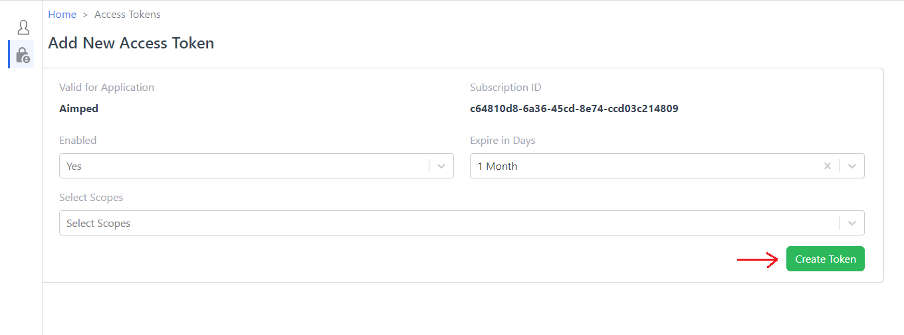
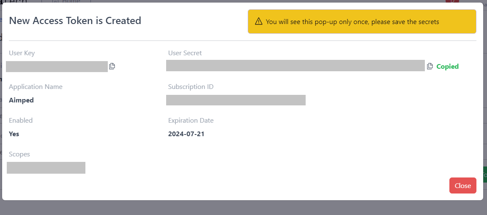
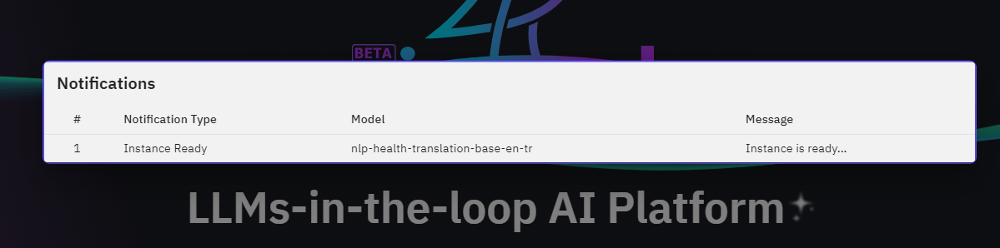

# Medical Translation API Tutorial

This tutorial will guide you through using the Medical Translation API. By following the steps below, you'll be able to translate medical text from one language to another using the API. The main steps involved are:

1. Creating an access token
2. Installing the aimped library
3. Running the API with your credentials and payload

## Step 1: Create Access Token

To use the API, you need an access token. Follow these steps to create one:

1. Go to the [API Access Token Creation Page](https://aimped.ai/a3m/#/tokens). You will land here:


2. Select scopes and click on "Create Token".
3. After clicking this button, you will see the pop-up from where you can copy the User Key and User Secret.



3. Copy the generated access tokens and keep it safe. You'll need it for the next steps.

## Step 2: Install aimped Library
To interact with the API, you need to install the aimped Python library. Open your terminal or command prompt and run the following command:


```python
pip install aimped==0.2.2
```

This command will install the necessary library to communicate with the API.

## Step 3: Run the API
Now that you have your access tokens and the library installed, you can run the API to translate text. Follow these steps:

### Set up your credentials:


```python
user_key = "YOUR_USER_KEY"
user_secret = "YOUR_USER_SECRET"
```

### Import the AimpedAPI class and set the base URL and model ID:


```python
from aimped.services.api import AimpedAPI

BASE_URL = 'https://aimped.ai'
model_id = "10"
```

### Initialize the API service:


```python
api_service = AimpedAPI(user_key, user_secret, {"base_url": BASE_URL})
```

### Define your payload:


```python
payload = {
  "data_type": "data_json",
  "data_json": {
    "text": [
      "Artificial intelligence, or AI, is technology that enables computers and machines to simulate human intelligence and problem-solving capabilities.",
      "The weather today is a perfect blend of warmth and coolness, with a gentle breeze rustling the leaves and a clear blue sky overhead. The sun is shining brightly, casting a golden glow on everything it touches, making it an ideal day for outdoor activities."
    ],
    "source_language": "en",
    "output_language": "tr"
  }
}

```

### Run the model:


```python
result = api_service.run_model(model_id, payload)
```

If you're running this model for the first time or after a long time, you might see the following message:


```python
print(result)
```

    {'message': 'We will notify you via email when the instance is ready.'}
    

Wait for the email notification indicating that the instance is ready. You will be notified on the [Aimped](https://aimped.ai/) as well.


You will see this notification, once the instance is ready:


Once you receive the email, run the model again:


```python
result = api_service.run_model(model_id, payload)
```


```python
result['output']['data_json']['result']['translated_text']
```


    ['Yapay zeka ya da yapay zeka, bilgisayar ve makinelerin insan zekâsını ve problem çözme yeteneklerini simüle edebilmesini sağlayan teknolojidir.',
     'Bugün hava sıcaklığın ve serinliğin mükemmel bir karışımıdır, yumuşak bir rüzgar yaprakları paslandırır ve açık mavi bir gökyüzü örtüsü ile. Güneş parlak bir şekilde parlıyor, dokunduğu her şeyin üzerine altın bir ışıma yapıyor, onu dış mekan aktiviteleri için ideal bir gün yapıyor.']


